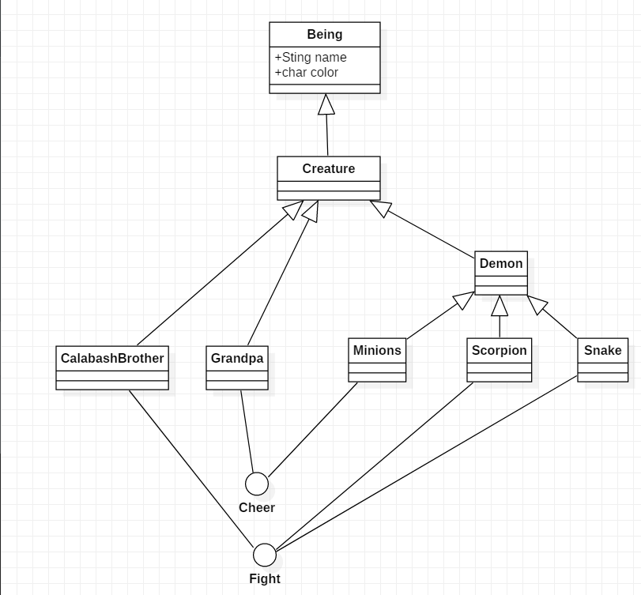
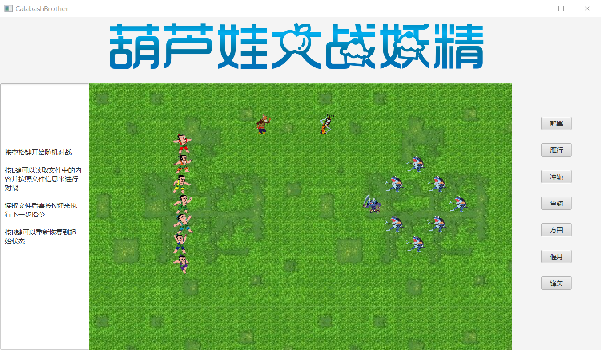

# 面向葫芦娃编程
## Final Project
### 各个包及其中类的职责
#### creature包
- Being类为最基本的类，含有所有事物（包括生物和非生物，非生物暂时未涉及到）的基本属性，name和对应的图片image；
- Creature类为所有生物的父类，除了父类的属性外，还添加了死后对应的图片deadImage和攻击力attack（在对战决定胜负的时候起作用）；
- CalabashBrother类为葫芦娃的类，含有葫芦娃对应的颜色和序号，创建葫芦娃对象时只需要传入相应葫芦娃的序号即可；
- CBEnum类为枚举类，包含了所有葫芦娃的基本信息；
- Grandpa类为老爷爷；
- Demon类为所有妖精的父类（包括蛇精、小喽啰、蝎子精），添加了死后对应的图片deadImage和攻击力attack（在对战决定胜负的时候起作用）；
- Minions、Scorpion、Snake类分别为小喽啰、蝎子精和蛇精；
- Cheer和Fight两个接口规定了部分角色应该有的功能(为了方便多线程的处理，暂时只设置葫芦娃可以对妖精发动攻击，cheer方法尚未加入)。




#### field包
- BattleField类为葫芦娃与妖精战斗的战场，有打印当前战场（print）和重置当前战场（clean）的功能；此外，每一次生物的移动、攻击、死亡、清理（将尸体移动至其他地方）都是在battleField类里实现的，所以它还会负责记录每一次的操作并最后一起储存到文件中；
- Cell类为战场上的每一个格点，葫芦娃或者妖精可以占据一个格点，一个格点只能被一名角色占据；
- Position为对坐标的表示。


#### formation包
- Formation为所有八个阵列的父类，包含构造方法和一个布阵的方法，构造方法需要传入阵列的行和列的大小，布阵的方法需要传入队列；
- 八个子类阵列有各自不同的布阵方法，各个阵列的人数已经提前规定。


#### sample包
- Controller类负责和fxml文件和main文件之间的对接；
- Coordinator类担任指挥员的角色，负责葫芦娃的排序以及一个队伍排成相应的阵列；
- Main类负责对各个角色、队伍、指挥员的初始化以及对各个事件的监听。


#### image包
- 内含所用用的图片。


#### example包
- 内有可以进行战斗回放的一些文件。


### 面向对象思想的体现

#### 1.封装
对绝大多数的类进行了封装处理，例如在CalabashBrother类中
```  
private String color;
private int rank;
    
public CalabashBrother(int CBindex){
    super(CBEnum.values()[CBindex-1].getName(),CBEnum.values()[CBindex-1].getImage(),CBEnum.values()[CBindex-1].getDeadImage(),CBEnum.values()[CBindex-1].getAttack());
    this.color=CBEnum.values()[CBindex-1].getColor();
    this.rank=CBindex;
}
    
public CalabashBrother(String name,int rank){
    super(name,null,null,0);
    this.rank=rank;
}
    
public String getColor(){
    return this.color;
}
public int getRank(){
    return rank;
}
```
对于类中的实例变量，使用private访问权限限制外界的访问，提供相应的get、set方法来访问相关属性，以提供对属性的赋值与读取操作。采用封装，也符合“高内聚（封装细节，便于修改内部代码，提高可维护性），低耦合（简化外部调用，便于调用者使用，便于扩展和写作）”的思想。

#### 2.继承
对于继承的体现主要集中的creatrue包和formation包中，使用继承之后，可以将一些共有的属性和方法定义在父类中，当某一个类需要使用到这些方法和属性的时候，就可以直接通过extends关键字就可以直接调用父类中的成员变量和方法，方便快捷，有利于代码的复用。

#### 3.多态
在使用了继承之后，利用java多态的特点，简化了代码编写和修改过程，对于creature和formation各自方法的调用更加方便灵活。


### 各类机制

#### 1.图形化
使用了javafx实现图形化，通过Controller，Main和sample.fxml之间的相互“配合”，将GUI部分和其他部分分离，彼此之间的依赖性减少。

#### 2.线程
每一个生物都有各自的线程，来进行移动或是攻击，对于葫芦娃和妖精分别设置了两个不同的线程，便于日后进行不同的扩展
```
 public class ThreadCB extends Thread {
    private Thread t;
    private CalabashBrother calabashBrother;

    ThreadCB(CalabashBrother calabashBrother) {
        this.calabashBrother=calabashBrother;
    }

    public void run() {
        while (!exit) {
           ...
        }
    }

    public void start () {
        if (t == null) {
            t = new Thread (this);
            t.start ();
        }
    }
 }
```
其中，对于线程的关闭，采用了一个exit标志，若游戏结束，则将exit标志设计为true，则所有线程都将关闭，若一个生物死亡，则用break跳出循环，单独关闭这个线程。为了防止资源共享产生的冲突，在实现移动和攻击的方法的时候，都使用了synchronized修饰符，保障多线程的安全性。

#### 3.泛型
```
public class Cell<T extends Creature> {
   private Position position;
   private T creature;
   private boolean ifEmpty;
       
   public void setCreature(T creature) {
       if(creature!=null && ifEmpty) {
           this.creature = creature;
           ifEmpty=false;
       }else if(creature==null) {
           this.creature=null;
           ifEmpty=true;
       }
       ...
   }
}
``` 
对于Cell类采用了泛型，这样在外界也可以直接了解到Cell里面放的是什么生物。

#### 4.注解
对于一些现在已经被弃用的方法，添加了@Deprecated注解；也使用了元注解，来记录开发信息。
```
@Documented
@Target(ElementType.PACKAGE)
@Inherited
@Retention(RetentionPolicy.RUNTIME)
public @interface AuthorAnno {
   String name() default "Xue Yuhao";
   String studentNumber() default "171250641";
   int revision() default 1;
}
```

#### 5.单元测试
对BubbleSort方法进行了单元测试，但是尝试测试BattleField里的方法的时候，由于都涉及到了图片的加载，产生了初始化的错误...所以无法进行单元测试。
``` 
@org.junit.Test
   public void testBubbleSort1(){
       calabashBrothers[0]=calabashBrother3;
       calabashBrothers[1]=calabashBrother4;
       calabashBrothers[2]=calabashBrother6;
       calabashBrothers[3]=calabashBrother2;
       calabashBrothers[4]=calabashBrother1;
       calabashBrothers[5]=calabashBrother7;
       calabashBrothers[6]=calabashBrother5;
       coordinator.BubbleSort(calabashBrothers);
       int[] result=new int[]{1,2,3,4,5,6,7};
       int[] rank=new int[7];
       for(int i=0;i<7;i++){
           rank[i]=calabashBrothers[i].getRank();
       }
       assertEquals(Arrays.toString(result),Arrays.toString(rank));
   }
```

#### 6.文件输入输出
```   
FileReader fileReader = new FileReader(file);
BufferedReader reader = new BufferedReader(fileReader);
String line = null;
while ((line = reader.readLine()) != null) {
   content.add(line);
}
reader.close();
```

```
File file=new File("demo.txt");
try {
   if(!file.exists()){
       file.createNewFile();
   }
   FileWriter writer = new FileWriter(file, false);   //覆盖原文件
   for (int i = 0; i < content.size(); i++) {
       writer.write(content.get(i) + "\n");
   }
   writer.close();
} catch (Exception e) {
   e.printStackTrace();
}
```
为了读取和保存一局游戏，使用了FileWriter和FileReader类。在打开文件的时候，基于装饰器模式，使用了BufferedReader。


#### 7.异常处理
在涉及到输入输出时必然会遇到对异常的处理。同时，在调用Thread.sleep()方法时，也会涉及到对异常的处理。
```
try {
   Thread.sleep(500);
} catch (InterruptedException e) {
   e.printStackTrace(); 
}
```

### 设计思路
- 对角色、阵列进行封装，便于后续的使用和维护，而指挥员角色的存在将角色和阵列有效地结合了起来；
- 总步骤大致为，在主类里初始化阵列和两个队伍（葫芦娃和妖精），再有指挥员来指挥队伍排成相应的队列，再一起空降至最初的阵列中，最后在安排老爷爷和蛇精的位置，再将阵列打印出来。


### 游戏过程
- 按空格键开始随机对战，首先会为每一个生物（葫芦娃、小喽啰、蝎子精）单独创建一个线程，然后各自在场地上移动，两个阵营都不能越过界限，当葫芦娃抵达界限且正前方有妖精时，会对妖精发起攻击，根据彼此攻击力的不同，获胜的概率也不同，败者直接死亡并被移动至坟墓区域（各自区域的最边上），当一方阵营全部死亡后，游戏结束，并将本场游戏中的所有操作存至一个文件中，默认为demo.txt（注：为了确保游戏一定能结束，在移动的过程中，两个阵营都会往中间靠拢，所以一定能决出最终胜负）；
- 按L键可以读出一个特定的文件，根据文件的内容来进行游戏，其中，文件的第一行标记了Demon阵营的阵列，后面的每一行都是一个操作，每按一次N键执行一个操作，直至结束；
- 按R键可以重新恢复至初始状态（注：初始状态下妖精为方円阵，游戏在正在进行的过程中无法恢复至初始状态）；
- 界面左边为游戏的一些基础介绍，右边的按钮可以自行选择Demon阵营的阵列（各自的人数都已经提前决定）。
- 附效果图：



### 总结与反思
- 经过一学期的“磨练”，深刻意识到自己以前认为的“面向对象”与真实的“面向对象”思想之前的差距，在以后写代码的过程中也会更加注重面向对象的思想以及代码的规范性；
- 掌握了Maven的使用，更加便于包的导入，同时也方便对项目的管理；
- 对注解、单元测试的掌握，增强了代码的可读性和正确性；
- 希望对设计模式可以更加熟练的掌握，在以后码代码的时候可以熟练运用；
- 对泛型、javafx、lambda表达式的掌握仍有欠缺，希望可以继续深入理解，在以后可以更加熟练地运用；
- 希望可以利用假期的时间继续丰富大作业的具体内容，使它变得更加生动有趣。